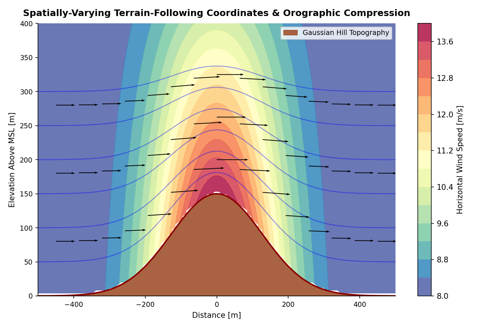
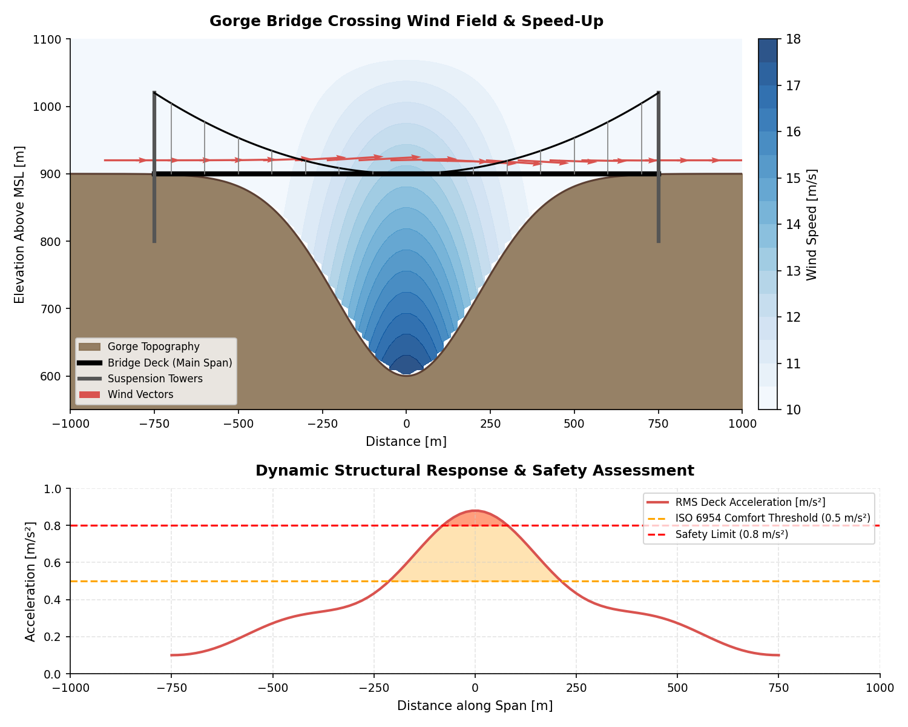
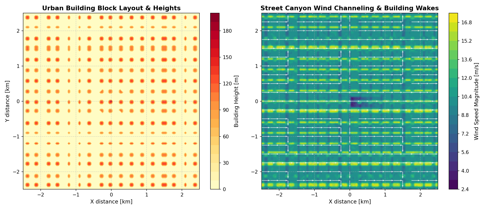
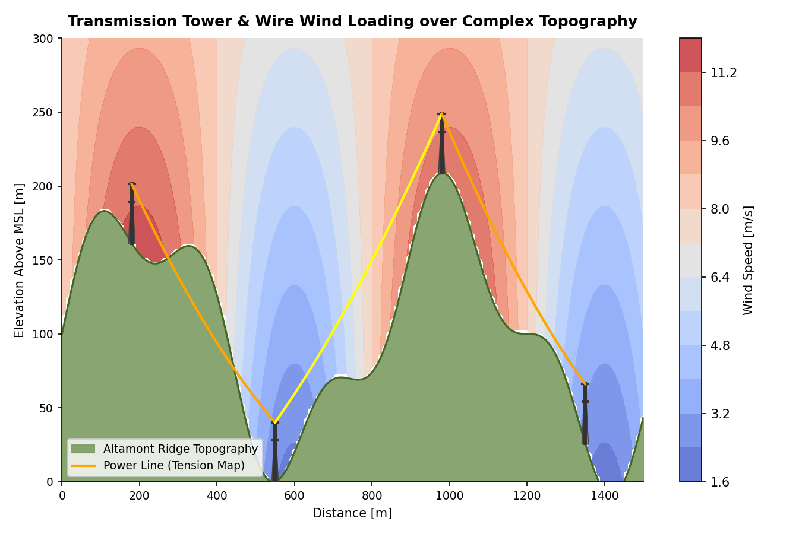
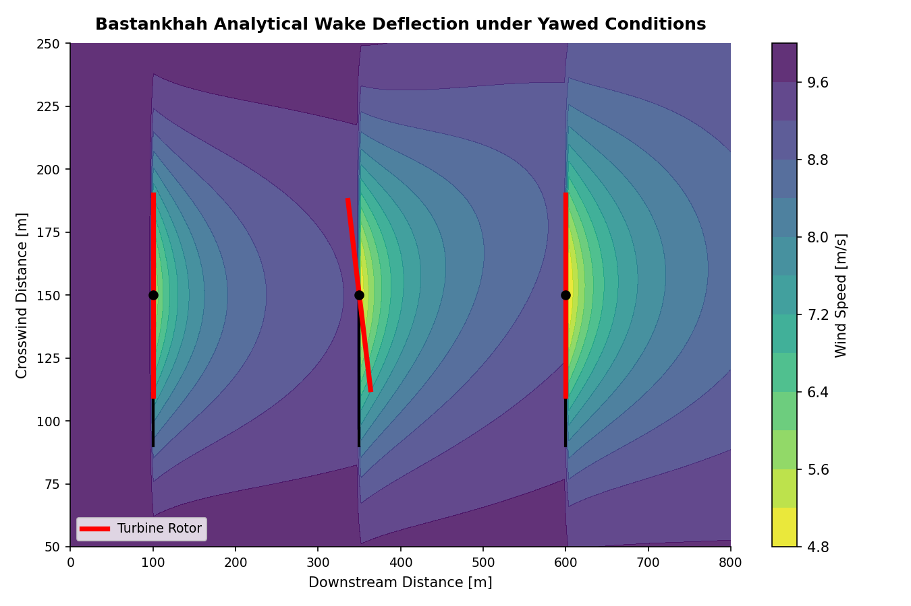
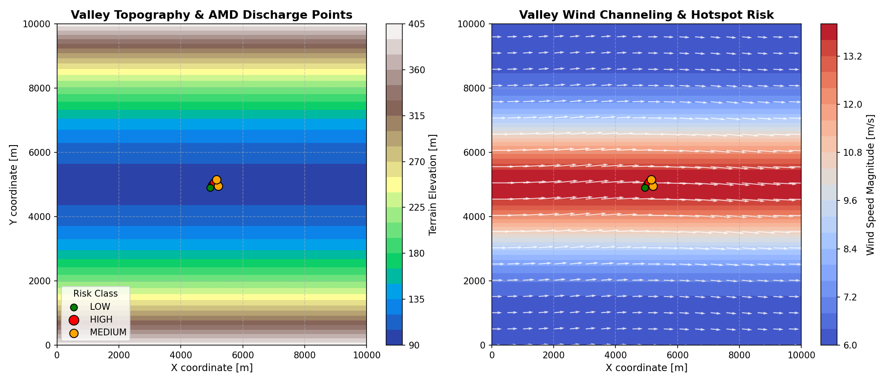
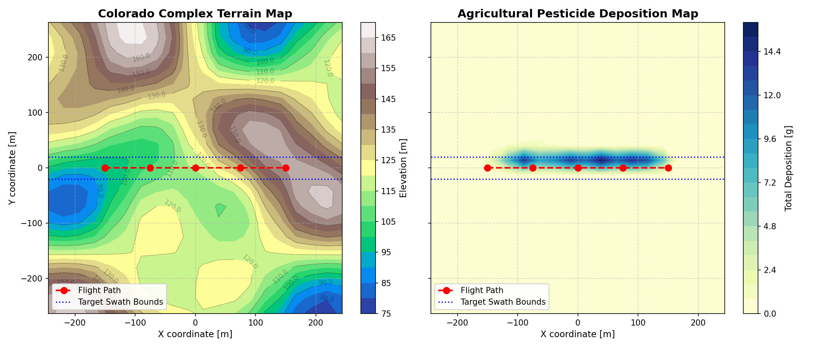
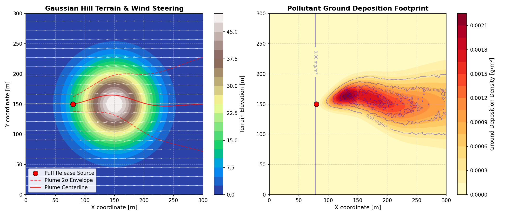

# massconsistent_amr

**massconsistent_amr** is a high-performance, GPU-accelerated (CUDA/HIP/SYCL), and MPI-parallel C++ 3-D mass-consistent wind diagnostic solver built on the AMReX framework. It features advanced terrain-following adjustment with spatially-varying anisotropy, building/canopy drag, analytical turbine wake modeling, and advanced atmospheric dispersion (Lagrangian Puff and LPDM). It also integrates with external tools via Python, supporting wind farm utilities (FLORIS, PyWake), wildfire modeling, and geochemical reactive transport (PHREEQC).

## Scenario Gallery

The solver supports diverse engineering, physical, and environmental wind-modeling scenarios. Below is a gallery of the eight core scenarios:

<table width="100%">
  <tr>
    <td width="50%" valign="top">
      <h4>1. Complex Terrain-Following Coordinate Flow</h4>
      <p>Horizontal wind speed distribution above complex terrain at 50 m above ground level, demonstrating terrain-following coordinate transformation and flow interactions without turbine obstruction.</p>
      
    </td>
    <td width="50%" valign="top">
      <h4>2. Gorge Bridge Crossing Wind Loading</h4>
      <p>Bridges crossing deep gorges experience extreme funneling speedup, vertical wind shear, and vortex-induced cable resonance.</p>
      
    </td>
  </tr>
  <tr>
    <td width="50%" valign="top">
      <h4>3. Urban Street Canyon & Building Wakes</h4>
      <p>Wind speed distribution at 15 m above ground level in an urban layout with complex building geometries including box, L-shaped, T-shaped, U-shaped, and polygonal buildings, showing the building mask and demonstrating wake effects and drag parameterizations.</p>
      
    </td>
    <td width="50%" valign="top">
      <h4>4. Transmission Tower & Line Wind Loading</h4>
      <p>Structural wind loading, catenary line tension, and sway displacement calculated dynamically across complex ridges. In the right panel of the loading visualization (plasma colormap), brighter colors (yellow/orange) indicate high-speed gap-flow winds causing elevated wind-drag mechanical loading and higher catenary line tension, while darker colors (purple/blue) represent lower wind speed and safer, lower line tension regions.</p>
      
    </td>
  </tr>
  <tr>
    <td width="50%" valign="top">
      <h4>5. Yawed Wind Turbine Wake Deflection</h4>
      <p>Analytical wake deficit showing lateral center-line deflection under yawed operation (Bastankhah model) to optimize array performance, with turbine rotor orientation indicators.</p>
      
    </td>
    <td width="50%" valign="top">
      <h4>6. Geochemical Hotspot & O₂ Delivery Detection</h4>
      <p>Valley AMD (Acid Mine Drainage) discharge point risk-classification based on wind-speed-dependent Sherwood mass transfer correlations.</p>
      
    </td>
  </tr>
  <tr>
    <td width="50%" valign="top">
      <h4>7. Agricultural Drone Spray Drift & Deposition</h4>
      <p>Modeling drone pesticide application, spray drift, dynamic canopy deposition, and rotor downwash velocity mapping over complex terrain.</p>
      
    </td>
    <td width="50%" valign="top">
      <h4>8. 3D Puff & Particle Dispersion Modeling</h4>
      <p>Continuous and puff source release tracking over complex terrain, incorporating Pasquill-Gifford atmospheric stability classes, wet/dry deposition, and boundary-layer reflection.</p>
      
    </td>
  </tr>
</table>

## CI / Build Status

| Configuration | Status |
|---------------|--------|
| Linux & macOS CPU (GCC/Clang, Release + Debug) | [](https://github.com/hgopalan/massconsistent_amr/actions/workflows/cmake_build.yml) |
| Windows CPU (MSVC, Release + Debug) | [](https://github.com/hgopalan/massconsistent_amr/actions/workflows/cmake_build.yml) |
| Linux GPU — CUDA 12.6 | [](https://github.com/hgopalan/massconsistent_amr/actions/workflows/cmake_build.yml) |
| Windows GPU — CUDA 12.6 ⚠️ | [](https://github.com/hgopalan/massconsistent_amr/actions/workflows/cmake_build.yml) |
| Linux GPU — HIP/ROCm 6.2 | [](https://github.com/hgopalan/massconsistent_amr/actions/workflows/cmake_build.yml) |
| Linux GPU — SYCL/oneAPI 2025.x | [](https://github.com/hgopalan/massconsistent_amr/actions/workflows/cmake_build.yml) |
| Documentation | [](https://github.com/hgopalan/massconsistent_amr/actions/workflows/docs.yml) |

⚠️ **Note:** Windows CUDA build is non-blocking (experimental); failures do not affect overall CI status.

📖 **[Full documentation](https://hgopalan.github.io/massconsistent_amr/)**

## Quick Start

```bash
git clone --recurse-submodules https://github.com/hgopalan/massconsistent_amr.git
cd massconsistent_amr
cmake -S . -B build -DCMAKE_BUILD_TYPE=Release -DMASSCONSISTENT_USE_VENDORED_AMREX=ON
cmake --build build --parallel
./build/wind_solver regtest/gaussian_hill/inputs.i
```

## Build Options

Customize the build by passing variables to CMake:

* `-DMASSCONSISTENT_GPU_BACKEND=[NONE|CUDA|HIP|SYCL]` — Enable GPU acceleration (default: `NONE`)
* `-DMASSCONSISTENT_BUILD_PYTHON_BINDINGS=[ON|OFF]` — Build Python API wrapper (default: `OFF`)
* `-DMASSCONSISTENT_ENABLE_MPI=[ON|OFF]` — Enable MPI multi-node parallelism (default: `OFF`)
* `-DMASSCONSISTENT_USE_VENDORED_AMREX=[ON|OFF]` — Use vendored or external AMReX (default: `ON`). For external, set `-DAMReX_DIR=/path/to/amrex`.

Example: `cmake -S . -B build -DMASSCONSISTENT_GPU_BACKEND=CUDA -DMASSCONSISTENT_BUILD_PYTHON_BINDINGS=ON`

## Features

### 1. Mass-Consistent Solver & Wake Modeling
- **Mass-Consistent Wind Field:** Enforces $\nabla \cdot \mathbf{u} = 0$ over complex terrain using a variational Lagrange multiplier approach.
- **Spatially-Varying Anisotropy:** Adapts adjustment coefficients ($\alpha_h / \alpha_v$) cell-locally based on slope, Richardson number, and Froude number.
- **Topographic Barrier Shielding:** Penalizes interpolation weights across high mountain ridges to prevent unphysical station influence in adjacent valleys.
- **Physical Parameterizations:** Integrates stable/unstable Monin-Obukhov profiles, orographic speed-up, katabatic/anabatic slope flows, sea breeze, and valley channeling.
- **Meteorological Ingestion:** Supports 3D NetCDF NWP inputs (e.g., WRF, GFS) with anisotropic Inverse Distance Weighting to preserve vertical profiles.
- **MacDonald Canopy Drag:** Models vegetative canopy drag, with exponential wind decay within canopy height ($h_c$) and displacement height corrections.
- **Building Wake Models:** Incorporates Röckle, Huber-Snyder, and AERMOD PRIME building downwash parameterizations with support for rectangular, cylindrical, and pitched-roof geometries. Advanced polygon support enables modeling of complex urban shapes (L/T/U-shaped buildings) and internal courtyards via composite geometry definitions. Enhanced wake models include: far-wake extension to 15H, oblique angle cavity scaling, tall-building corrections, Gaussian lateral profiles, upwind recirculation zones, corner acceleration effects, and horseshoe vortex modeling (see [Building Wake Enhancements](docs/building_wake_enhancements.rst) for details).
- **AMReX Embedded Boundary (EB) Support:** Alternative geometry representation utilizing AMReX EB2 to represent arbitrary 3D shapes (such as boxes, cylinders, spheres, and STL geometries), marking solid cells via fluid volume fraction.
- **Analytical Turbine Wakes:** Supports Jensen, Bastankhah Gaussian, TurbOPark, and Gauss-Curl Hybrid wake models, including wake centerline deflection, yaw, and AEP calculation.
- **Wake Superposition & Added Turbulence:** Computes overlapping deficits (quadratic/linear/geometric) and wake-added turbulence (Crespo-Hernández, Frandsen) with convective buoyant wake destruction.

### 2. 3D Scalar Transport and Mixing
- **3D Advection-Diffusion:** Solves transport of temperature and moisture using conservative upwind advection and mixing-length eddy diffusivity.
- **1D Mixing Solver:** Simulates vertical surface layer transitions and boundary layer mixing.
- **Spatially-Varying Boundary Layer Height:** Diagnoses boundary layer height ($h_{pbl}$) using column-scanning bulk Richardson number profiles.
- **Sky View Factor & Solar Shading:** Computes sky view factor from combined terrain+building elevation field and solar shading based on sun position, enabling radiation-dependent thermal effects and urban canyon heating.

### 3. Dispersion Model
- **Gaussian Puff Dispersion:** Tracks 3D Gaussian puffs with Pasquill-Gifford stability, Briggs plume rise, gravitational settling, dry deposition, and precipitation scavenging.
- **Lagrangian Particle LPDM:** Simulates stochastic particle trajectories with Wiener processes, including a vertical drift correction to prevent spurious accumulation in inhomogeneous diffusivity fields.

### 4. Synthetic Fluctuations (Turbulence)
- **Terrain-Aware Masking:** Confines synthetic turbulent fluctuations to fluid regions and blends smoothly near terrain boundaries.
- **Spectral Turbulence Models:** Generates fluctuations using Kaimal or Von Kármán spectra with height-varying intensity and coherence, plus Mann 3D anisotropic turbulence box modeling.
- **Downstream Export:** Exports OpenFAST/TurbSim compatible binary (.bts) formats.

### 5. Infrastructure Vulnerability Assessment
- **Bridge Loading:** Computes vertical/lateral drag forces, ISO-comfort human accelerations, and vortex-induced resonant shedding frequencies.
- **Transmission Line Assessment (IEEE 738):** Solves conductor heat balance to calculate dynamic line ratings, sag, and wind drag across complex terrain.
- **Structure Loading:** Evaluates static base shear, dynamic amplification (gust response), lateral bending deflection, and structural fragility curves.

### 6. External Coupling & APIs
- **Wildfire Levelset:** One-way coupling with fire front propagation using sensible heat flux feedback.
- **FLORIS & PyWake integration:** Exports resolved wind fields and data formats to FLORIS, PyWake, and WAsP.

### 7. Data Assimilation
- **Hybrid Ensemble Kalman Filter (EnKF):** Optional feature for rapid wind field correction using sparse observations from weather stations, LiDAR, and UAVs. Features covariance localization, mass conservation projection, and GPU-ready architecture. Disabled by default; enable via ParmParse configuration.
- See [Data Assimilation Documentation](https://hgopalan.github.io/massconsistent_amr/data_assimilation_usage.html) for usage and [Development Status](https://hgopalan.github.io/massconsistent_amr/data_assimilation_development.html) for technical details.

## Test Cases

Test cases are located in `test/` and documented in `test/README.md`.

## Regression Tests

Over 80 automated regression tests are located in `regtest/` covering the core solver, wake models, turbulence, dispersion, and wildfire coupling.

Run them with CTest from your build directory:
```bash
ctest -L regtest
```

## Agricultural Drone Operations

The solver provides a dedicated Python module (`agricultural_drone`) for simulating agricultural drone operations. This module supports parsing and interpolating 3D flight trajectories from CSV telemetry, modeling 3D analytical rotor downwash velocity fields (including jet expansion and forward flight deflection), and simulating spray drift and canopy deposition using either Lagrangian Particle Dispersion Models (LPDM) or Gaussian Puff dispersion.

For guides and API documentation, see the [External Coupling Documentation](docs/external_coupling.rst).

## External Coupling

The solver integrates with external models for geochemical and fire modeling. For guides, API references, and examples, see the [External Coupling Documentation](docs/external_coupling.rst) and the [wildfire_levelset](https://github.com/hgopalan/wildfire_levelset) repository.

## License

See [LICENSE](LICENSE).
